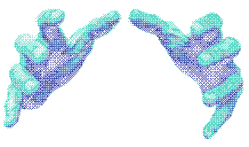
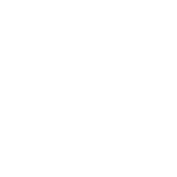

  

<h1 style="
    color: #fff;
    text-align: center;
    text-shadow: 
        0 2px 1px rgba(0,0,0,0.3),  
        0 4px 2px rgba(0,0,0,0.2), 
        0 6px 3px rgba(0,0,0,0.1);
">
 <del>Welcome? No.</del>
</h1>
<h2 style="text-align: center;">
  
Hewwo!!:3 Im GuroKawa(,,¬﹏¬,,)
  
</h2>
═════════════════════════════════════════════════════════════
<h3 style="
    border: 2px solid #ff69b4;
    border-radius: 10px; 
    padding: 10px; 
    width: 200px;
    background-color:  rgba(0,0,0,0.7);
    color: #fff;
    text-align: center;
    margin: 20px auto;
    box-shadow: 0 0 10px #ff69b4, 0 0 20px #ff69b4
">
  
	Im little bit  
	✨𝓯𝓻𝓮𝓪𝓴𝔂✨
  
</h3>
═════════════════════════════════════════════════════════════

  

  

    

      どこにいたって、 人は繋がっているのよ
    

    

      Doko ni itatte, hito wa tsunagatte iru no yo
    

  

  

    <h3 style="text-align:center;">Thats about meee, yeep</h3>
    <ul>
      <li>I love doing something in computer</li>
      <li>I am a little silly sysadmin</li>
      <li>Learning pentesting bleh and other</li>
      <li>Linux enjoyer btw𓁹‿𓁹 HEH.</li>
      <li>( ╹ -╹)?Idk what else to add </li>
      
    </ul>
      

    
  

  

  

═════════════════════════════════════════════════════════════

